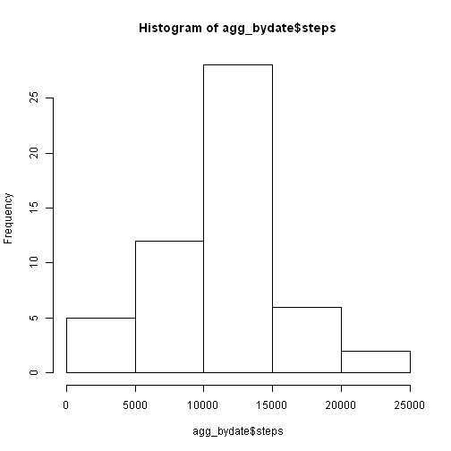
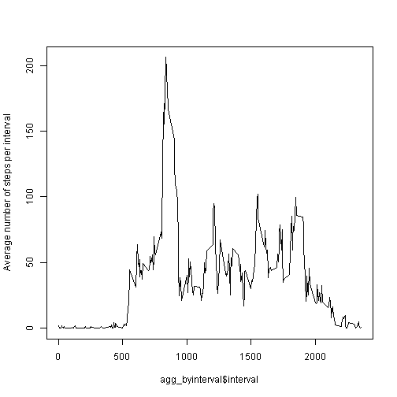
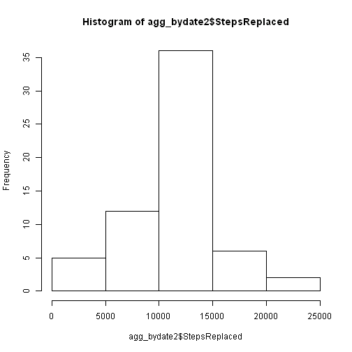
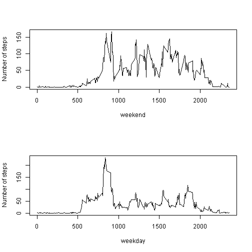

# Reproducible Research: Peer Assessment 1


## Loading and preprocessing the data

Load data and recode date data to proper format


```r
indata <- read.csv("activity.csv")
indata$DT <- strptime(indata$date, "%Y-%m-%d")
```


## What is mean total number of steps taken per day?
Make a histogram of the total number of steps taken each day. 
Calculate and report the mean and median total number of steps taken per day.

```r

agg_bydate <- aggregate(steps ~ date, data = indata, FUN = sum)

hist(agg_bydate$steps)
```

 

```r

## Calculate and report the mean and median total number of steps taken per
## day
mmean <- mean(agg_bydate$steps)
mmedian <- median(agg_bydate$steps)

paste("Mean: ", round(mmean, 1))
```

```
## [1] "Mean:  10766.2"
```

```r
paste("Median: ", round(mmedian, 1))
```

```
## [1] "Median:  10765"
```


## What is the average daily activity pattern?
Make a time series plot (i.e. type = "l") of the 5-minute interval (x-axis) and the average number of steps taken, averaged across all days (y-axis)


```r
agg_byinterval <- aggregate(steps ~ interval, data = indata, FUN = mean)
names(agg_byinterval)[2] <- "MeanSteps"

plot(agg_byinterval$interval, agg_byinterval$MeanSteps, type = "l", ylab = "Average number of steps per interval")
```

 


Let's find which 5-minute interval, on average across all the days in the dataset, contains the maximum number of steps?

```r
paste("Maximum average number of steps is:", round(max(agg_byinterval$MeanSteps), 
    1))
```

```
## [1] "Maximum average number of steps is: 206.2"
```

```r
paste("at a time interval: ", agg_byinterval[which(agg_byinterval$MeanSteps == 
    max(agg_byinterval$MeanSteps)), 1])
```

```
## [1] "at a time interval:  835"
```


## Imputing missing values

Calculate and report the total number of missing values in the dataset (i.e. the total number of rows with NAs)

```r
sum(is.na(indata))
```

```
## [1] 2304
```


Create a new dataset that is equal to the original dataset but with the missing data filled in with means. I'll divie an oroginal dataset into two - with NAs and with coplete data. Replace NAs with means for respective time interval. Just copy data for the second data set. Then merge them.

```r
m <- merge(indata, agg_byinterval)
mNA <- m[is.na(m$steps), ]
mNNA <- m[!is.na(m$steps), ]
mNA$StepsReplaced <- mNA$MeanSteps
mNNA$StepsReplaced <- mNNA$steps
merged <- rbind(mNNA, mNA)
```

Make a histogram of the total number of steps taken each day and calculate and report the mean and median total number of steps taken per day. 

```r
agg_bydate2 <- aggregate(StepsReplaced ~ date, data = merged, FUN = sum)
hist(agg_bydate2$StepsReplaced)
```

 

```r

mmean2 <- mean(agg_bydate2$StepsReplaced)
mmedian2 <- median(agg_bydate2$StepsReplaced)

paste("Mean: ", round(mmean2, 1))
```

```
## [1] "Mean:  10766.2"
```

```r
paste("Median: ", round(mmedian2, 1))
```

```
## [1] "Median:  10766.2"
```

Mean is the same, medin become equal to mean


## Are there differences in activity patterns between weekdays and weekends?

Create a new factor variable in the dataset with two levels - "weekday" and "weekend" indicating whether a given date is a weekday or weekend day.


```r
merged$WD <- weekdays(merged$DT)
merged$WDD[merged$WD == "Monday"] <- "weekday"
merged$WDD[merged$WD == "Tuesday"] <- "weekday"
merged$WDD[merged$WD == "Wednesday"] <- "weekday"
merged$WDD[merged$WD == "Thursday"] <- "weekday"
merged$WDD[merged$WD == "Friday"] <- "weekday"
merged$WDD[merged$WD == "Saturday"] <- "weekend"
merged$WDD[merged$WD == "Sunday"] <- "weekend"
```

Create timeseries plots for weedays and weekend


```r
agg_byintervalWD <- aggregate(StepsReplaced ~ interval, data = merged[merged$WDD == 
    "weekday", ], FUN = mean)
agg_byintervalWE <- aggregate(StepsReplaced ~ interval, data = merged[merged$WDD == 
    "weekend", ], FUN = mean)

par(mfrow = c(2, 1))

plot(agg_byintervalWE$interval, agg_byintervalWE$StepsReplaced, type = "l", 
    ylab = "Number of steps", xlab = "weekend")
plot(agg_byintervalWD$interval, agg_byintervalWD$StepsReplaced, type = "l", 
    ylab = "Number of steps", xlab = "weekday")
```

 

During weekend object can run during the day. On weekday object run mainly in the morning. 
